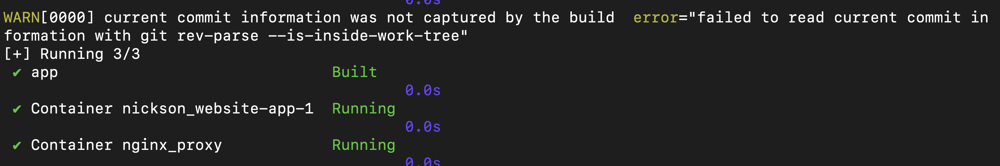

# Web Service Deployment

This project is for web service deployment pratices.

DevOps technique: Docker, Nginx, Node.js, CI/CD

## Docker

[install docker, docker-compose](https://docs.docker.com/engine/install/ubuntu/)

set up docker environment by Dockerfile

```
docker compose up --build -d
```

shutdown environment

```
docker compose down
```


## Nginx

[install nginx](https://docs.nginx.com/nginx/admin-guide/installing-nginx/installing-nginx-open-source/)

docker-compose.yml would mount nginx.conf to /etc/nginx/conf.d/default.conf. Then we could successful deploy our node.js backend in nginx web service

## SSL certificate setting

self-signed certificate

```
sudo mkdir -p /etc/nginx/ssl
sudo openssl req -x509 -nodes -days 365 -newkey rsa:2048 \
    -keyout /etc/nginx/ssl/nginx-selfsigned.key \
    -out /etc/nginx/ssl/nginx-selfsigned.crt
```

## Deployment Display

call "https://$server_ip/api"

